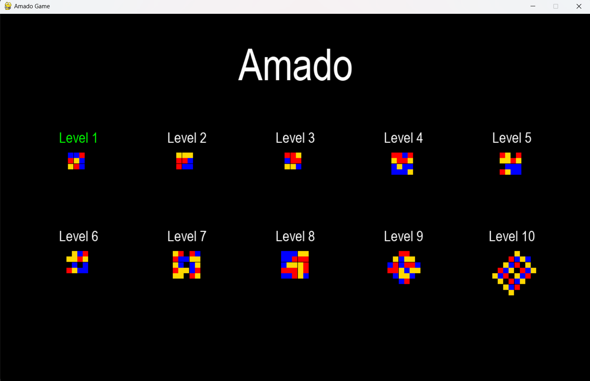
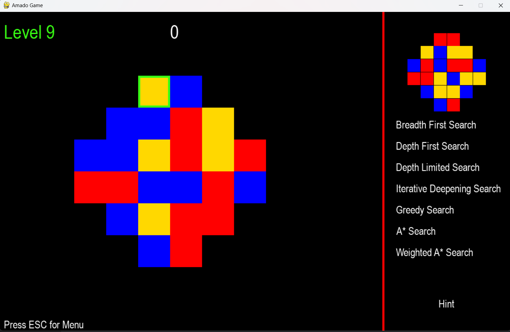
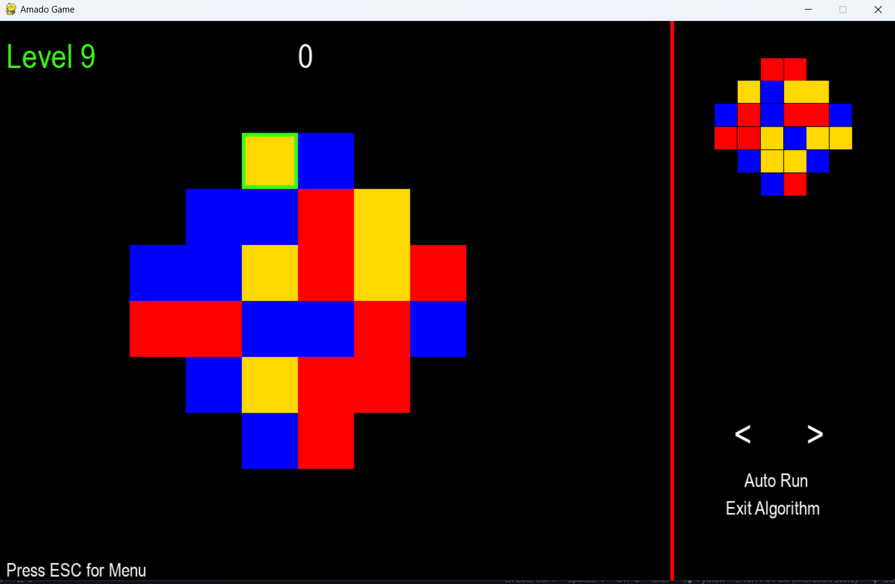
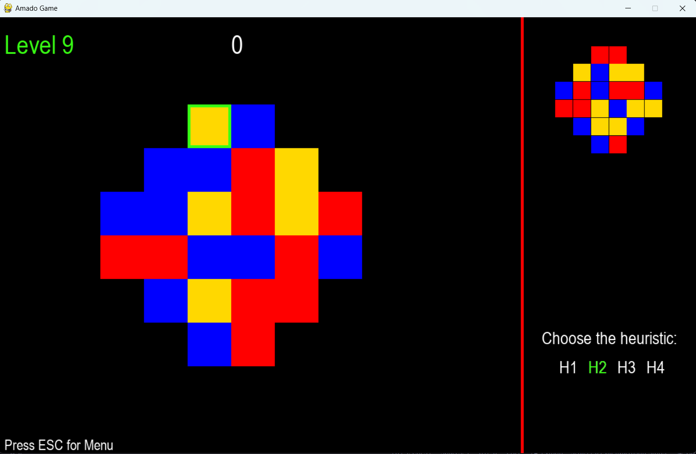
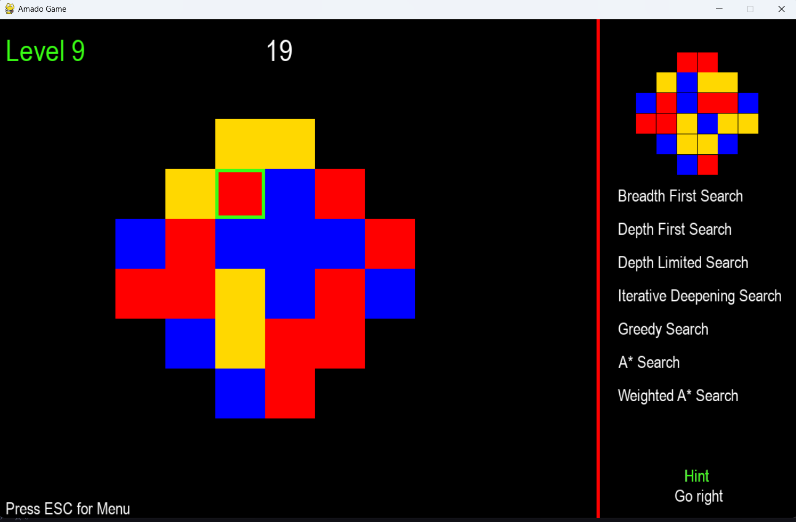
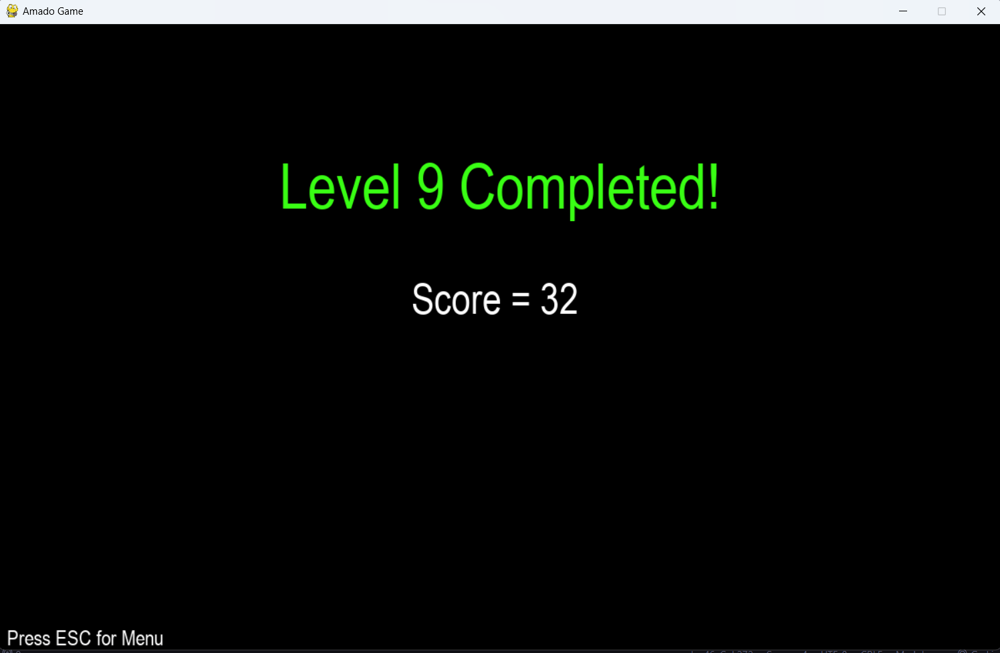

# Amado Game

## How to Run the Program

To start the game, it is necessary to install the `pygame` library and run the commands:
```bash
pip install pygame
python main.py
```

To access the analysis of the algorithms, it is necessary to install the memory_profiler library and run the commands:
```bash
pip install memory_profiler
python analysis.py
```

## How to Use the Program

The game begins with a menu where the player can choose the level they want to play. There are 10 levels with varying difficulties, with level 1 being the easiest and level 10 the hardest. To select the desired level, use the keyboard arrows and, to confirm the selection, press the Enter key.



After selecting the level, the player is directed to the game page, where they find the initial board (on the left), which should match the final board (displayed on the right). To move the cursor, the player uses the keyboard arrows, with the square bordered in green being the currently selected one. On the left side of the divider, the number of moves made so far is also displayed. On the right, along with the algorithms available for selection, there is the option to request hints on how to solve the game, all accessible via the mouse. It is possible to exit the level by pressing the ESC key.



After choosing an algorithm to solve the level, the player can interact with the program. They can use the arrows displayed on the screen to perform the previous or next movement, click on Auto Run to view the resolution of the level automatically, or click on Exit Algorithm to exit the algorithm menu and return to playing manually.



When selecting algorithms with limited depth, the player is asked to indicate the maximum depth they want. If an algorithm that uses heuristics is selected, the player is asked to choose the heuristic to use.




When clicking on the Hint option, the best move to make is provided.



When the player finishes the level, they are redirected to the level completion page, where it is possible to view the number of moves made, represented by the Score. To return to the main menu, the player must press the ESC key, and from there, they can choose a new level.


